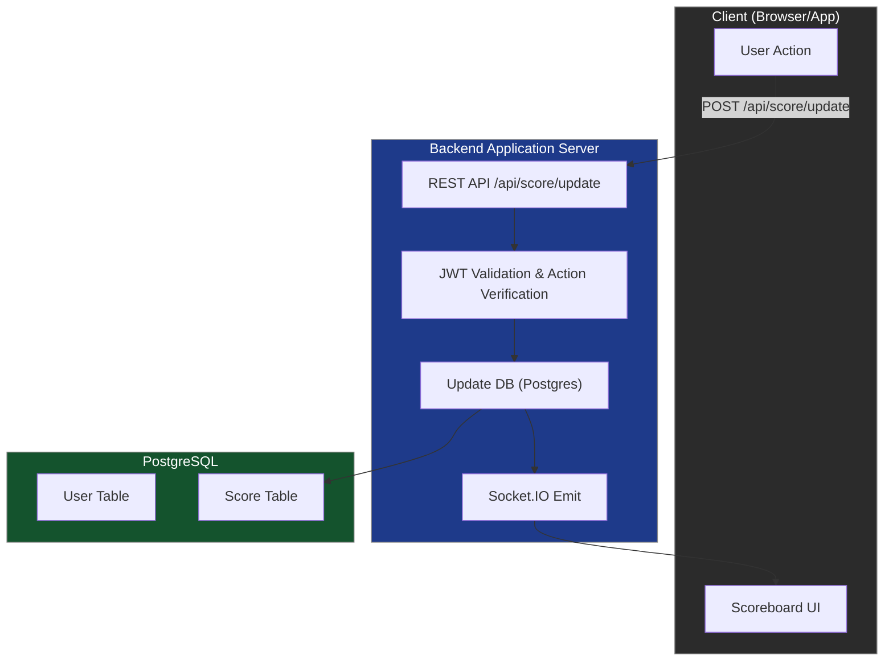

# Project Specification: Real-time Score Tracking

**Application Version:** 1.0.0  
**Document Version:** 1.0.1  
**Last Updated:** 2025-08-24  

## 1. Introduction
This document specifies the requirements and architecture for a real-time score tracking system using **Socket.IO** for real-time communication.

---

## 2. Functional Requirements

### FR-01: User Connection
- Users must authenticate using a **JWT** token before connecting.
- Socket.IO connection must be rejected if token is invalid.

### FR-02: Real-time Score Update
- Users’ scores must update in real time across all connected clients.
- Updates are broadcast directly via **Socket.IO**.

**Example Event:**
```json
{
  "event": "scoreUpdate",
  "userId": "12345",
  "newScore": 120
}
```

### FR-03: Secure Score Submission
- Clients submit score changes via a REST API.
- Backend validates the request, updates DB, and then broadcasts event.

**Endpoint:**
```sh
POST /api/score/update
Body: { "userId": "12345", "actionId": "xyz-001" }
```

**Backend flow:**
```sh
1. Validate JWT token.
2. Verify `actionId` is unique (to prevent replay attacks).
3. Update user’s score in DB.
4. Emit event via Socket.IO to all connected clients.
```

**Response:**
```json
{
  "status": "success",
  "newScore": 120
}
```

### FR-04: Prevent Unauthorized Score Increase
- Users must be authenticated with a **valid JWT**.
- Each action must have a unique ID validated by backend.
- No direct manipulation of score is allowed from frontend.

---

## 3. Non-functional Requirements
- **Scalability**: Backend handles real-time updates.
- **Low Latency**: Socket.IO provides <200ms propagation.
- **Security**: JWT validation required for all actions.

---

## 4. System Architecture
```sh
User Action
   │
   ▼
Frontend (Web)
   │  POST /api/scores/update
   ▼
Backend (API Server) ────► DB (Update score)
   │
   ├── Validate token
   ├── Apply score rules
   └── Broadcast new top 10 via WebSocket
           │
           ▼
       All Clients update UI
```

---

## 5. Database Design  

**Table: users**  
- id (uuid, PK)  
- username  
- score (integer, default = 0)  

**Table: actions**  
- id (uuid, PK)  
- user_id (FK → users.id)  
- action_type  
- is_counted (boolean)  
- created_at  

---

## 6. API Endpoints

### POST `/api/score/update`
```sh
Headers: { "Authorization": "Bearer <token>" }
Body: { "userId": "12345", "actionId": "xyz-001" }
```

**Response:**
```json
{
  "status": "success",
  "newScore": 120
}
```

### GET `/api/score/top10`
```sh
Headers: { "Authorization": "Bearer <token>" }
```

**Response:**
```json
[
  { "userId": "12345", "score": 120 },
  { "userId": "67890", "score": 115 },
  ...
]
```

---

## 7. Real-time Communication

### Socket.IO Events
- **`connect`** → Authenticate user with JWT.
- **`scoreUpdate`** → Broadcast new scores to all connected clients.
- **`disconnect`** → Handle cleanup.

**Example Socket Flow:**
```js
socket.on("scoreUpdate", (data) => {
  updateScoreBoard(data.userId, data.newScore);
});
```

---

## 8. Error Handling

### Common Error Responses
```json
{
  "status": "error",
  "message": "Invalid token"
}
```
```json
{
  "status": "error",
  "message": "Action already processed"
}
```

### Socket Error
```json
{
  "event": "error",
  "message": "Unauthorized connection"
}
```

---

## 9. Data Flow Diagram

The following diagram illustrates the data flow between Client, Backend, and Database:


